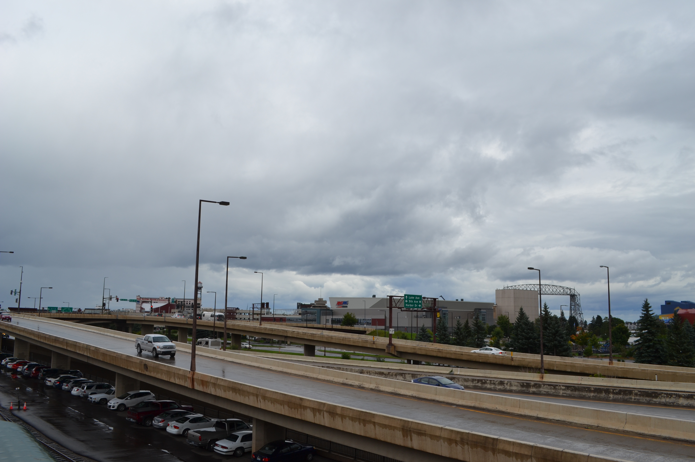

We just completed an exhausting 1 week tour of the northern states: North Dakota, Minnesota, Wisconsin, and Michigan. One of the major take
aways for both Heather and myself was the various infrastructure we traversed in the course of our travels. I would like to discuss a bit of
this, with some accomonying amateur photography.

1. This was the best case of a roller joint on a steel frame structure 
I have ever seen. It bring back mixed feelings about days in 
Structure Engineering courses during my undergraduage degree.

2. This was a mediocre brewery, but a great spot in Grand Forks, ND.
It is situated adjacent to a major rail corridor and take full advantange.
There are clear views of the trains rolling into town and by the brewery
thanks to large windows looking out onto the street and alley. It was
an excellent example of linking the present use of an older structure with
its surrounding environment and historical industrial roots.

3. We drove into Duluth, MN with very little knowledge of its layout and no
plans as to what to visit. This is I35 passing through downtown. We pulled off
the highway at a downtown exit and planned to walk somewhere for lunch.
This rapidly became more of a challenge than expected as it turned out
the downtown is largely commercial and wayfinding signage proved less
than helpful. The interstate acts to separate the downtown from the lakeshore.
It is unclear from this side of the interstate whether there are additional services
on the lakeshore side of the roadway and it is clearly prohibitive to pedestrians.
We were able to find a pedestrian overpass to the lakeshore, which led to a quaint
lakeside retail area. We were able to find an excellent brewery (sense a pattern)
called Canal Park Brewing Company. I noticed a similar patttern of the commercial centre
being separated from the tourist-focused lakeshore upon arrival in Toronto. This is a model
reminiscent of the days of Robert Moses in New York, with his focus on placing large-scale
transportation facilities along prime waterfront real estate.

4. We were unable to ride the train, but it gives some incentive to return to the
Duluth, MN area. It promises excellent views of the Lake Superior shore and ends at
Two Harbors, MN. It feels like a disservice to my profession to miss out on an historical
train ride.
