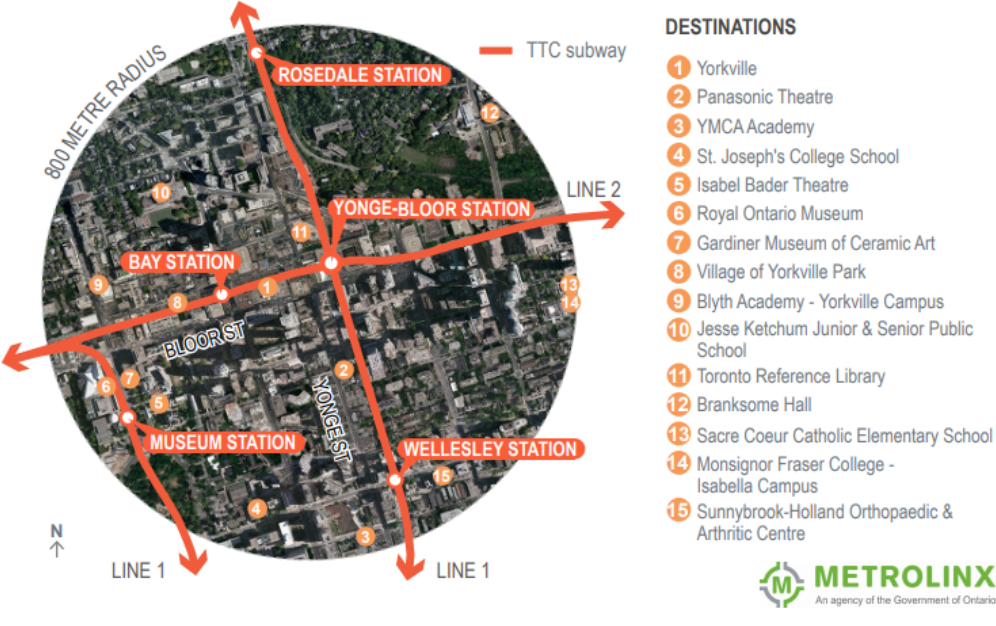

*This post originated as a course assignment for CIV1535: Tranportation and Development*

**Introduction**

I have chosen to study the Yonge-Bloor mobility hub for this assignment. The reason for this choice is principally that I live within the mobility hub. I have lived in University of Toronto Student Family Housing on Charles St. since October, 2017. I believe it is important to know your community, particularly as a researcher of urban processes, and this report serves as a means of becoming more familiar with mine. Yonge-Bloor is a lively area of Toronto, bordered by the upscale neighbourhood of Yorkville to the north, LGBTQ enclave of Church-Wellesley to the east, and the University of Toronto to the west. The intersection of Yonge St. and Bloor St. is presently experiencing major changes. The recently completed One Bloor East is a 76 storey mixed use development [16], with a focus on luxury retail and condominiums. Its twin is currently under construction at 1 Bloor West, which will top out at 85 storeys and make it the tallest building in Canada (CN Tower still slightly taller structure due to antenna) [16]. My wife and I live in subsidized housing in an apartment complex adjacent to this development. We therefore have a vested interest in ensuring there are affordable housing and shopping options in the area. This report will review the existing transportation and built form within the Yonge-Bloor mobility hub, as well as future development in the area. Emphasis will be placed on maintaining strong public transit and active mode connections to the financial district to the south on Bay St. and the University of Toronto. The affordability of retail and housing floorspace will also be examined in the light of ongoing changes to the built form. Finally, recommendations will be made for how to ensure the successful development of the area as a mobility hub for all residents.

**Existing Conditions**

*Transportation*

Metrolinx classifies the Yonge-Bloor area as a gateway hub. The hub is centered about the intersection of Yonge St. and Bloor St. and is located along the northern edge of downtown Toronto. Yonge-Bloor subway station is located below the intersection, which is one of the busiest stations in the system. It acts as a junction between Line 1 and Line 2. Within the 800m radius defined by Metrolinx (I use this 800m definition, rather than the 2km radius defined in the assignment outline). The density of development is such that there is sufficient scope for discussion within this constrained radius. A wider radius would confuse analysis as it would include a large portion of central Toronto, including the University of Toronto and Ryerson University.} are four additional TTC subway stations: Bay, Wellesley, Museum, and Rosedale. These stations are identified in Figure 1, according to their location within an 800m radius of Yonge-Bloor station.

**Figure 1**: Overview of Yonge-Bloor Hub Area.

The 2015 user volumes for each station are presented in Table 1. The hub has a low rate of car ownership of 0.6 cars/household, which is less than half the Greater Toronto Hamilton (GTHA) average of 1.4 [11]. Transit ridership is high, with 57% of trips destined for the hub and 34% of trips originating in the hub being by public transit during the morning commute period [11]. Many residents of the hub walk or cycle to work, with these modes comprising 30% of all such trips [11]. The area has a 100% walk score and there are 3km of bikeways within the defined 800m radius [11].

**Table 1**: Summary of 2015 average daily usage volumes at TTC subway stations [21].

The major transportation concern for the Yonge-Bloor hub is capacity at Yonge-Bloor subway station. The TTC estimates the section of Line 1 between Finch and Union Stations (in which Yonge-Bloor station is centrally located) carries 450,000 passenger trips per day [17]. The station is situated at the edge of downtown, meaning that during the morning commute it suffers from the combined effects of high upstream boardings and low upstream alightings. Exacerbating this congestion, the station is also a transfer point for the east-west Line 2 subway. Since 2001, over 50,000 additional residents have been added within a 10 minute walk of the station (this is greater than the 800m study radius), representing a 15% increasing in the population compared with city-wide population growth of 10% [17]. In the same vein,  downtown employment has grown by 40% over the same period compared with only 10% growth city-wide [17]. These trends have put significant strain on the local transportation infrastructure. Capacity is exceeded at Yonge-Bloor station for 90 minutes during an average morning commute and has been exceeded during the morning rush hour since about 2006 [17].

*Built Form*

The Yonge-Bloor mobility hub has a population of 32,500 and has a wide variety of employment opportunities via roughly 56,600 jobs [11]. About 68% of Yonge-Bloor hub residents rent their dwellings [11]. Residential building stock is dominated by high rises, with 88% of residential developments exceeding five storeys [11]. This leads to a high population density of 162 persons per ha, compared with the regional average of 7.9 persons per ha [11]. The population of Yonge-Bloor is predominantly of a working age (between 15-64) and the average household size is 1.6 persons per dwelling [11]. Most of the mobility hub consists of the former Village of Yorkville. This began as a small village, incorporated in 1853, on the northern border of the City of Toronto [6]. Yorkville developed independent of Toronto for many years and had its own town hall and fire station [6]. It was annexed in 1883 and, in the 1920s, Bay St. was extended north through Yorkville [6]. This changed the focus of the community from Yonge St. and split the community in half. Most of the development since the 1970s has occurred along Bloor St. and the historic core of Yorkville has remained largely intact [6]. A cultural focal point for the community is the Toronto Reference Library, opened in 1977 at Yonge St. and Asquith St. (see Figure 2) [20]. The library building acts as a venue for many cultural events and is frequently used as a refuge from the cold by the local homeless population.

**Figure 2**: Toronto Reference Library.

The hub is home to the most expensive retail corridor in the country, nicknamed 'The Mink Mile' [9]. The stretch of Bloor St. between Bay St. and Aveneue Rd. had an average rent of \$325 per sqm in 2015 [9], which has continued rising in the subsequent years. High rents have meant increasing building heights, as developers try to maximize their investment per sqm. Local residents and business owners have been critical of recent developments [6]. They are concerned that taller buildings and higher densities will place strains on restaurants, shops, and services [6]. Most of the building stock added in the last 5 years has been upscale condos, which overshadow the tree-lined streets of Yorkville and do not integrate with the existing community. Residents worry these new buildings do not fit with the 'look and feel' [6, p. 32] of the community. Local councilor Kristyn Wong-Tam has repeatedly expressed concern about developments being approved in isolation, without consideration for their place in the community [16].

Taking a specific example of the changes, consider Figure 3 from the perspective of low and middle income residents. Most of the new developments are upscale boutiques, which serve the regional (or even national) community according to the hierarchy of Central Place Theory [12].

**Figure 3**: Bloor St. boutiques.

A contrasting example of existing retail is Kitchen Stuff Plus on Yonge St. north of Bloor St. It sells reasonably priced household products of use to local residents. It should be noted that Kitchen Stuff Plus presently rents space in a building slated for rezoning to allow for a 25 storey condo tower [3] and its continued existence at this location is uncertain.

For residents of University of Toronto Student Family Housing, these changes do not bode well for affordability. The changing face of the community is evident in Figure 4, which depicts Charles St. (south of Yonge-Bloor station). Visible are restaurants in retrofitted houses, a series of new condo towers, and a major construction site along Yonge St. The University of Toronto subsidizes its family housing, but this does nothing for the ability of student families to enjoy the amenities of their community. This influx of high income residents will increases the probability of higher priced restaurants and grocery chains moving into the hub. Even should the same retail establishments remain, from a classical economic perspective, this change is equivalent to a shift in the demand curve to the right. Under such conditions, the same number of people would be willing to pay a higher price for the same good because of a rise in the median income. Similarly, a larger population would shift the demand curve to the right and further increase prices for all goods. This analysis is based on a fairly restrictive interpretation of market area. The price of many goods will be governed by the demographics and demand of the wider GTHA region. However, the hub does exhibit a trend towards concentration of upscale retail establishments, which supports this hypothesis.

**Figure 4**: Charles St. at Balmuto St. facing east.

**Planned Changes**

*Transportation*

According to the Metrolinx documentation for the Yonge-Bloor mobility hub, there are no major changes planned for the transportation infrastructure in the hub [11]. The hub is well served by subway stations and has frequent bus service to the CBD on Bay St. On the surface, congestion at Bloor-Yonge station suggests a lack of capacity for hub transit demand. However, this is principally an issue of misaligned supply and demand for residents north of the hub. The City of Toronto and TTC are working to reduce congestion on Line 1 and this station plays a key role in these efforts. In 2013, they increased staffing at Yonge-Bloor station [2] and continue to pursue options to increase reliability and reduce headways on Line 1. The long-term solution proposed by the City of Toronto is the construction of a relief line to alleviate congestion on the portion of Line 1 south of Bloor [2]. The current plan is for a line from Pape Station on the eastern section of Line 2 to travel south to Queen St. and connect with Line 1 at Queen St. Station [2]. A second long-term solution under consideration by the TTC is the use of a differential pricing strategy by time of day [17]. With there now being a uniform deployment of PRESTO gates at all subway stations, the TTC is studying how changes in the fare structure might spread travel more evenly throughout the day [17]. Clearly, they do not want to push users towards other modes and care will be required to ensure continued ridership.

The TTC is exploring several other options to reduce crowding at Yonge-Bloor station for the immediate term. They propose a reprisal of the customer awareness campaign run during 2015 [17]. This will seek to address false alarms on Line 1 subways, which account for about 80% of all alarms [17]. Alarm events are a major source of delay on the system and the TTC was able to reduce false alarms by 33% during their previous campaign [17]. They also plan to improve wayfinding and customer information to improve flow through the station [17]. Finally, the TTC is considering reinstatement of *run-as-directed* trains [17]. These are empty trains introduced to the system at an intermediate point during delay incidents. They suggest this strategy could be adopted during the peak periods to alleviate congestion at Yonge-Bloor station [17].

A more localized transportation concern is a proposed change in the traffic pattern on Charles St. at Balmuto St. [8]. The Greater Yorkville Residents' Association (GYRA) has requested the City of Toronto convert this section of Charles St. into two-way operation. The area of analysis is depicted in Figure 5 facing west towards Bay St. The purpose of the change is to provide residents and visitors additional options to exit the area to either of Bay St. or Yonge St. [7]. Admittedly, this intersection can become congested during peak periods of activity. None the less, in an area where the majority of trips are made by transit and active modes [11], one should question whether this change is the best course of action. The current intersection design narrows the crossing for pedestrians and provides additional recreation space for children living in University of Toronto Student Family Housing. The proposed changes would increase the number of vehicle trips on Charles St. and increase the frequency of pedestrian-automobile interactions. This does not fit the primary purposes of the street as a residential connector and location for community activities (in an effort to take an active role in the community, I presented my concerns in a letter to Councilor Kristyn Wong-Tam and City Engineer Ann Khan following a request for community input).

**Figure 5**: Charles Street at Balmuto St. facing west.

*Built Form*

According to the Ward 27 development permit map, there are currently 10 development applications under review by Toronto City Council, 17 permits approved, 8 being considered by the Ontario Municipal Board (OMB), and 5 council decisions overturned by the OMB in the past year [14]. The Yonge-Bloor mobility hub is a hot-spot for development, with developers seeing the appeal of upscale boutiques, high quality restaurants, and great accessibility. The desire by developers to maximize their profits per unit of land area has put increasing pressure on Toronto City Council to approve changes to zoning in the area. The new condo tower and hotel at the corner of Bloor and Yonge (see Figure 6) is an excellent example of this trend. Zoning set in 2003 specifies the maximum height for this location as 205m, which was later increased to allow the 275 m height of One Bloor East [15]. Prices for units range from \$300,000 for a 540 sqft unit, to over \$2 million for a 2,110 sqft unit [15]. With these upscale dwellings comes a demand for new shopping options. An anchoring retail tenant for the development will be McEwan, an upscale grocery chain advertised as a 'gourmet marketplace by celebrity chef Mark McEwan' [10].

**Figure 6**: View of 1 Bloor East condos and hotel.

Across the street, on the southwest corner of Yonge St. and Bloor St., an even taller tower has broken ground. Currently branded as 'The One', this residential and commercial tower will top out at 85 storeys and include 80,457 sqm of floor space [16]. A major concern with this tower is its 28.3 floorspace area ratio (FAR) [16], which is nearly double that of the just completed One Bloor East, itself a high density development. This will place a significant burden on community infrastructure. The bottom 8 floors of 'The One' are slated for retail use, but the type of retail again raises concerns of affordability and meeting the needs of the local community. Speculation suggests the bottom three floors will be leased to Apple Inc. for a Canadian flagship store [16]. One cannot survive on iPhones alone and it is difficult to see how this type of retail will satisfy the daily needs of its tenants. This high density and outward focus is a common thread in recent and proposed developments in the community. Figure 7 gives a sense of the current and proposed tall buildings in the hub. I generally agree with the economist Edward Glaeser with respect to a higher density driving down the long-run cost of housing in the city [5]. Unit construction costs tend to fall with increasing building height. However, to draw from his field of economics, it is perhaps a necessary but not sufficient condition for affordability in the city. Good planning is also required to ensure developers are providing retail that meets the needs of the community. In addition, affordability is not an *ex ante* outcome of density. The condos currently under construction in the Yonge-Bloor mobility hub are clearly tailored towards a high income clientele. Other measures are required to ensure residence in the Yonge-Bloor mobility hub is attainable for all Torontonians.

**Figure 7**: Existing and planned tall buildings.

**Policy Review**

With respect to policy, the major concern put forward in the literature is zoning permits [16]. The local Toronto City Councilor, Kristyn Wong-Tam, has experienced this struggle on many occasions. Prior to the construction of both towers at Yonge St. and Bloor St. she raised concerns that these developments are too high density and their integration with the community was not sufficiently considered by their developers [16]. This issue has its roots in constitutional structures placing management of cities under the purview of the provincial government. The Ontario Municipal Board (OMB) becomes involved in zoning applications under the Ontario Planning Act [4]. It has the power to overturn decisions made at the municipal level, upon request for review by the developer. Aaron Moore of the University of Toronto states that the OMB is 'the most powerful board of its kind in North America' [13, p. 1900] and possesses 'the same power, rights, and privileges as the Ontario Superior Court of Justice' [13, p. 1932]. Research by Moore shows the OMB finds in favour of the developer in the majority of cases and developers sometimes bypass the municipal government entirely, going directly to the OMB [13].

In the case of 'The One', a report by City of Toronto planning staff recommended as a condition for approval that the developer construct a PATH connection to the adjacent retail developments along Bloor St. With this report, the developer brought its case to the OMB, despite the City having not issued a decision on the matter and still being in consultation with local residents. This condition was removed and a deal struck that included \$21.9 million cash-in-lieu by the developer [16]. The majority of this amount will be used for a pedestrian connection, but these sorts of deals are far from ideal. In my opinion, a cash offer shifts the balance of power to the developer and away from existing community residents. The City of Toronto made it clear it wanted a PATH connection. By allow the developer to provide cash-in-lieu, it gives the developer an avenue for influencing how the money is spent in the community. This might include streetscaping that the developer would otherwise complete using other funds, but could request be completed by City staff using this cash amount.

**Critical Assessment of Mobility Hub**

I identify two components of transportation and land use planning not considered in the Metrolinx mobility hub documents for Yonge-Bloor [11]: 1) inefficient distributions of population and employment and 2) rent control.

*Residence and Work Location*

As I see it, the major issue for the Yonge-Bloor mobility hub is the distribution of residence and work locations. The condominiums currently under development in the hub are targeted towards high income households working in professional services. In contrast, the employment being generated is in the retail sector. This will produce a high level of *cross commuting*, wherein residents will commute to work downtown (or in other office centres) and retail workers will commute into the hub during the day. The Yonge-Bloor hub is centrally located in Toronto and could readily support professional service firms. There is scant justification for residents of the hub to add their commuting trips to the already congested subway, nor is it efficient for retail workers to be excluded from residing in the hub. In an effort to coordinate the expanding number of condominium towers in the hub, the City of Toronto should put some serious thought into how they can encourage office and professional service firms to locate in the hub. This would help to alleviate congestion on the Line 1 subway by co-locating labour and work, which would alleviate some of the pressure on transit infrastructure. Infrastructure investments will still be required to bring the Line 1 subway within its capacity, but smart land use policy would go a long way towards meeting this objective.

*Rent Control*

Rent control is a policy favoured by many regional governments to address rising prices in the residential rental market. Rent control was first introduced in Ontario in 1975 as a temporary measure, which was maintained through the 1980s [19], when the provincial government extended rent control to all residential properties. Advocates of rent control argue that rental prices in Ontario are rising faster than the rate of inflation, thus pricing low and middle income household out of the market [1]. As of 2006, there were 66,858 households on the social housing wait list in the GTHA [1]. However, there is a strong consensus among economists that rent control is an inefficient policy and not the answer to housing affordability [19]. A 1988 study from the University of Toronto by Smith [18] found the major effects of the 1975 policy were increased rents for post-1975 units, reduced new constructions, and the generation of a severe housing shortage. Even at this time, the findings of Smith suggest the prevailing trend was the conversion of rental stock into other tenure types or uses (i.e. condominiums or retail). So, what is the answer to this ongoing issue?

I support the recommendations of economists at CIBC, who suggest increased focus on purpose-built rental units and affordable housing [19]. Returning to the context of the Yonge-Bloor mobility hub, the construction of purpose-built rental units would provide housing for University of Toronto students and local retail workers. This policy would increase the supply of rental housing to satisfy demand, rather than restricting the supply price and encouraging developers to shift construction into other tenure markets. By placing a ceiling on rents, the provincial government reducing tax revenues [18], which could be used as rent subsidies. The outcome of this policy can be assessed along several dimensions. First, developers could rent units at market prices and would be required to construct rental units. The first-order effect of this might be higher rental prices, but increased supply would push down the price. Second, the increased tax revenue from additional units would provide the provincial government the means to subsidize rents for those who cannot afford the market price.

**Conclusions**

Completing this project has given me insights into my community and encouraged me to become involved in its shaping. The Yonge-Bloor mobility hub is a dynamic area of student and professional residents, upscale boutiques, and lively streets. It is also an area facing challenges of affordability and uncoordinated densification. The finding of this report is that local and provincial governments are aware of these issues, but have not correctly specified their solutions. Yonge-Bloor station frequently operates above capacity and adding new residents to the hub, without providing them employment within walking distance, will place an unnecessary burden on the system. The hub is highly walkable and well served by bicycle infrastructure, so there is no reason why its residents should add to subway congestion. The province should reconsider their policy of rent control and explore alternatives provisions for affordable rented housing. This would encourage rental development in the hub, rather than the high priced condos typified by 'The One'. This would encourage a mix of sociodemographic groups and a source of local retail labour. Finally, policies should be put in place to incentive office space within the hub. This would represent a more efficient distribution of residence and work locations, which would reduce congestion at Yonge-Bloor station.

**References**

[1] ACTO. Why rent control? Tech. rep. Advocacy Centre for Tenants Ontario, 2006. url: https://www.acto.ca/assets/files/docs/LR_RentReg_WhyRentRegulation_0306_revised.pdf.

[2] Diana Chu. Report from the City Manager on advancing planning and design for the relief line and Yonge subway extension. Tech. rep. City of Toronto, 2017. url: https://www.toronto.ca/legdocs/mmis/2017/ex/bgrd/backgroundfile-103533.pdf.

[3] City of Toronto. City of Toronto By-law No. xxx-2017. Tech. rep. City of Toronto, 2017.

[4] Environment and Land Tribunals of Ontario. About the OMB. 2018. url: http://elto.gov.on.ca/tribunals/omb/about-the-omb/.

[5] Edward Glaeser. Triumph of the city. 1st ed. Penguin Books, 2012.

[6] Greenberg Consultants, ERA Architects, and Michael Spaziani Architects Inc. Bloor-Yorkville/North Midtown planning framework and implementation strategy. Tech. rep. 2015.

[7] GYRA. GYRA news. 2018. url: https://static1.squarespace.com/static/54827e32e4b01930082ab8b6/t/5a5ecde9f9619acff15125d5/1516162541000/GYRA+Newsletter+January+2018.pdf.

[8] Khan Ann S. Two-way operation - Charles Street West: Report for action. Tech. rep. Toronto: City of Toronto, 2017. url: https://www.toronto.ca/legdocs/mmis/2017/te/bgrd/backgroundfile-102829.pdf.

[9] Gary Marr. Toronto’s Mink Mile is Canada’s most expensive place to rent retail space, but still a long way from Fifth Avenue. Nov. 2015. url: http://business.financialpost.com/real-estate/property-post/torontos-mink-mile-is-canadas-most-expensive-place-to-rent-retail-space-but-still-a-long-way-from-fifth-avenue.

[10] Catering McEwan Grocery and Prepared Meals. Don Mills location. 2018. url: http://mcewan.mcewangroup.ca/locations/don-mills/.

[11] Metrolinx. Yonge-Bloor mobility hub profile. Tech. rep. Metrolinx, 2015. url: http://www.metrolinx.com/mobilityhubs/en/map/mobility_hubs_map/MHP_Yonge-Bloor.pdf.

[12] Eric J. Miller. CIV1535: Spatial competition. 2018.

[13] Aaron Moore. Planning politics in Toronto: The Ontario Municipal Board and urban development. University of Toronto Press, 2013.

[14] Office of Kristyn Wong-Tam. Ward 27 development. url: http://www.ward27news.ca/development.

[15] Mark Ostler. “Planning’s perspective on Yonge-Bloor”. In: NovæResUrbis (Nov. 2007). url: http://www.lib.uwaterloo.ca/documents/071102NRT.pdf.

[16] Jennifer Pagliaro. How Toronto’s latest mega tower got the green light. Sept. 2016. url: https://www.thestar.com/news/city_hall/2016/09/12/how-torontos-latest-mega-tower-got-the-green-light.html.

[17] Mike Palmer. Managing crowding on Line 1: Report for action. Tech. rep. Toronto: TTC, 2018. url: http://www.ttc.ca/About_the_TTC/Commission_reports_and_information/Commission_meetings/2018/January_18/Reports/6_Managing_Crowding_on_Line_1_Yonge.pdf.

[18] Lawrence B Smith. “An Economic Assessment of Rent Controls: The Ontario Experience”. In: Journal of Real Estate Finance and Economics 1 (1988), pp. 217–231. url: https://link.springer.com/content/pdf/10.1007/BF00658918.pdf.

[19] Benjamin Tal. “CIBC capital markets”. In: 4 (2017). url: https://economics.cibccm.com/economicsweb/cds?ID=2595&TYPE=EC_PDF.

[20] Toronto Public Library. Toronto Reference Library. 2018. url: https://www.torontopubliclibraryca/detail.jsp?R=LIB018.

[21] Toronto Transit Commission. Toronto Transit Commission subway ridership, 2015. Tech. rep. Toronto: TTC, 2016. url: https://www.ttc.ca/PDF/Transit_Planning/Subway%20ridership%202015.pdf.
