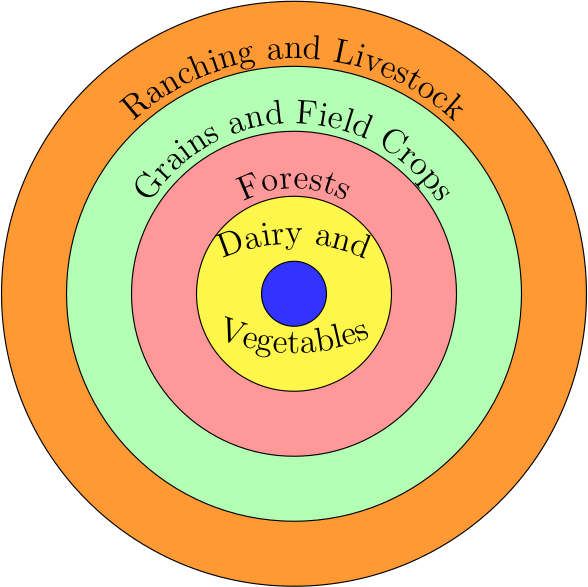
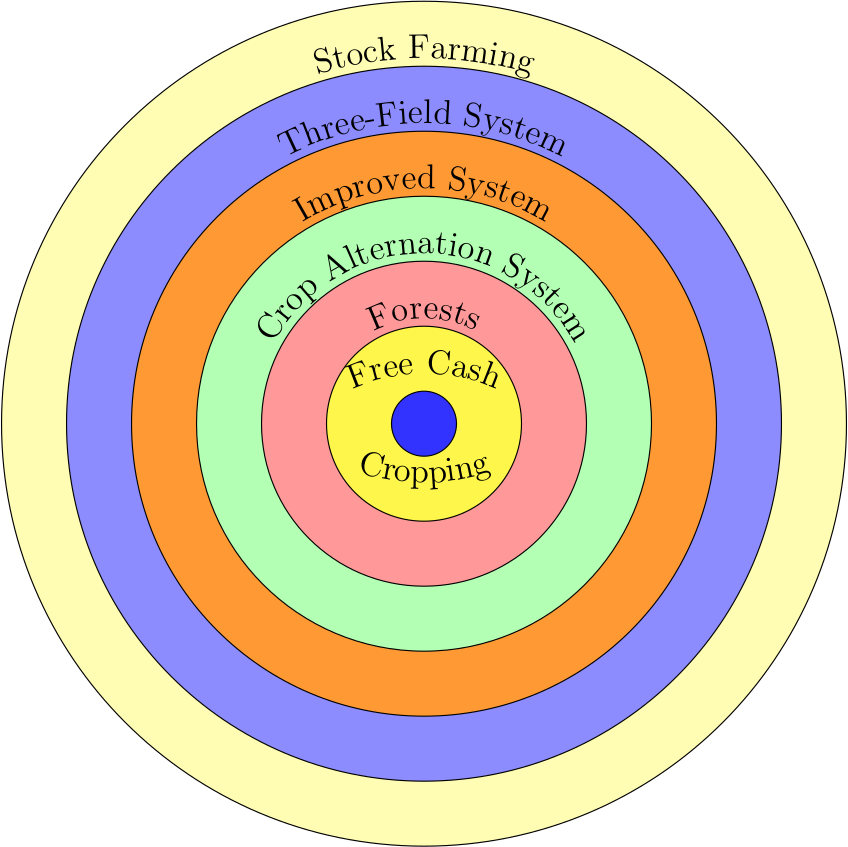
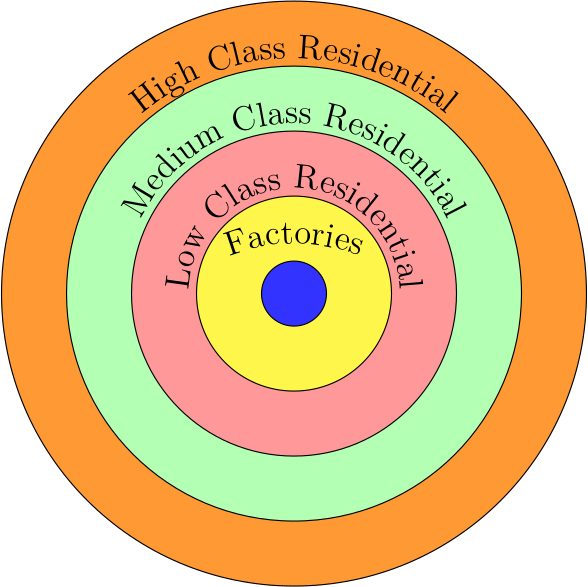

*This post originated as a course assignment for CIV1535: Tranportation and Development*

*"I hope that the reader who is willing to spend some time and attention on my work will not take exception to the imaginary assumptions I make at the beginning because they do not correspond to conditions in reality"*

-Johann Heinreich Von Th\"unen [8, p. 3]

To understand the importance of Von Th\"unen, one must place his accomplishments in the context of his time. Johann Heinrich Von Th\"unen was born June 24, 1783 in northwest Germany [8] (all references to the life of Von Th\"unen are taken from the introduction by Sir. Peter Hall to the English translation). His father died a few short years later and his mother subsequently married a timber merchant in 1789 [8]. From a young age, Von Th\"unen showed an aptitude for mathematics and was sent to stay with his grandfather in Jever to attend secondary school [8]. There he received additional instruction in differential and integral calculus [8]. Von Th\"unen left school in 1799 to pursue his interest in agriculture on a local farm [8]. In 1802 he began studies at the local agricultural college. Already in 1803, at the age of 20, he was developing the seed for what would become *The Isolated State* [8]. In a paper entitled *Description of Agriculture in the Village of Gross-Flottbeck*, he notes that those farms closer to the nearby city of Hamburg are able to increase their yields through use of dung from the city as a fertilizer [8]. It is important to note that Von Th\"unen was not an academic in the traditional sense. He spent the majority of his life tending to his farm at Tellow. Von Th\"unen remained apprised of the state of economics in Germany and England, reading Adam Smith and others in his spare moments. His own contributions to the field were based on years of data collection on his farm. The quantitative nature of today's economics may lead one to gloss over this time of data collection. However, economics at the time of Von Th\"unen had more in common with politics and philosophy. The writings of Smith, Ricardo, and Say are filled with qualitative discourses on the workings of the economy. Of Von Th\"unen, the Nobel Prize winning economist Paul Samuelson wrote he “elaborated one of the first models of *general equilibrium* and did so in terms of realistic *econometric* parameters.” [6, p. 1468, emphases by the original author].

The influence of Von Th\"unen on English economics was dampened by the lack of an English translation. Without a working knowledge of German, French, or Russian, the interested English reader could not read Von Th\"unen until 1960 - and only Part III. It was not until 1966 that Part I and II of *The Isolated State* were made available in English. This is the edition used in the present review, which was translated by Carla M Wartenberg, with an introduction by the noted Town Planner Sir. Peter Hall. However, such was the magnitude of his work, that Von Th\"unen's influence still permeates the literature. As of 1963, Hall [8] was able to find 60 English references to the work of Von Th\"unen on location theory. These are not minor references and include works by Beckmann, Isard, L\"osch, Marshall, and Schumpeter. This review is comprised of four sections: 1) definition of the isolated state model of Von Th\"unen, 2) overview of his theory of land rents, 3) its extension into a theory of location with transportation costs, and 4) a summary of the breadth of contributions made by Von Th\"unen in *The Isolated State*.

**The Isolated State**

Von Th\"unen begins his treatise on location theory with a concise outline of the region of analysis and problem statement. Chapter One consists of three short paragraphs, which outline the model region as an isolated plain with a single large town at its center. The central town must supply the surrounding rural areas with all manufactured products. The plain is assumed to be uniformly capable of cultivation and of the same fertility. This is important to the analysis as it makes the location of the various crops in the region wholly a function of distance from the town and the cost of production for each crop. Chapter Two continues the development of this framework by defining the problem for analysis as: "What pattern of cultivation will take shape in these conditions?" \cite[p. 8]{VonThunen1966VonStaat}. In a few short sentences, Von Th\"unen summarizes his thesis that crops grown close to the town will be heavy or perishable, or some combination thereof. In these two single page chapters, he presents the thrust of his argument and the remainder of *The Isolated State* consists of fleshing out these arguments and adding empirical evidence using data collected on his Tellow estate.

It is a fascinating study to note how little change there has been in economic models since the time of Von Th\"unen. His *isolated state* is quite similar in its assumptions to the monocentric city and two island models that continue to dominate urban economics. These assumptions continue to provide the researcher the tractability of equations to examine the dynamics of urban regions and their development. The assumption of uniform fertility certainly deviates from the reality of soil conditions, but this shortcoming falls away when applied to other industries. In our present knowledge economy, the conditions of the land have no bearing on the productivity of the firm inhabiting the space. The theories of transportation cost and land rent developed by Von Th\"unen in the mid-19$^{th}$ century remain dominant forces in location choice today. Our populations are increasingly urban, but the cost of land remains a pressing issue in cities such as Toronto and Vancouver, governing the type of housing and industry that occupies it. The cost of transportation still leads similar firms to cluster and affects the cost of food and other goods. In the words of the Von Th\"unen scholar Erich Schneider even "where his name seems to have been forgotten, Th\"unen has worked." [7, p. 27] (the English translation quoted here is from the introduction by Sir. Peter Hall to the English translation of *The Isolated State* by Wartenberg [8 p. xliv])

**Theory of Land Rents**

Von Th\"unen begins his discussion of land rents by contrasting it with that of Adam Smith. Von Th\"unen bases his definition on the pure product of land, which can be defined as total farm revenue less interest on capital and wages. He argues that buildings, fences, and machinery are removable capital and the landowner should not consider their returns in land rents. A person purchasing land will determine the price they are willing to pay based on the net land rent after deducting interest on capital investment payments. The details of this definition become clear when contrasted with that of Smith, who defines *land rent* as the income drawn from the property by the landowner. Von Th\"unen terms this value *estate rent* and argues it cannot be readily determined from empirical data as it contains an undefined portion of the return on capital. Von Th\"unen makes a series of observations on this result, which introduce notions of general equilibrium and the long-run economic behaviour of landowners. He finds the definition of Smith to be predicated on an assumption of fixed capital, which is only true in the short-run. Von Th\"unen observes that the two components of this *estate rent* will act in opposing directions. If the price of agricultural products falls, the *estate rent* may drop below the interest payable on capital invested in the buildings. In such a case, the pure *land rent* will be negative, but the landowner will continue to work the land so as to obtain some revenue from the property. Similarly, if the *estate rent* remains fixed, while capital interest rates rise, pure *land rent* will drop in proportion to the rise in rent from invested capital. According to this definition, *estate rent* governs the decision to farm a plot of land. Von Th\"unen contrasts this perspective with a long-term decision by the landowner. He considers the case of a landowner who constructs a building on a plot of land with negligible value for farming. The *estate rent* will be governed by the prevailing rate of interest and the *land rent* will be zero. If the interest rate rises, but farm revenue remains fixed, the *land rent* will become negative. Cultivation will continue because the building is immobile. However, if there were to be a fire and the building burnt to the ground, the landowner has no reason to rebuild and the land will "revert to wilderness" [8, p. 21]. Von Th\"unen observes that time has a similar effect on physical capital and will deteriorate buildings over time. Based on this observation, he argues that it is the value of *land rent*, and not *estate rent*, that governs whether land "continues in cultivation" [8, p. 21].

Von Th\"unen is most frequently cited in location theory for his model of concentric rings of agricultural production differentiated by product, but he does not proceed directly from a discussion of land rents to this model. Von Th\"unen was a farmer before all else and his initial analysis stemmed from an urge to define the laws governing commodity prices in his *isolated state*. This is based on data from his Tellow estate for the 5 years between 1810 and 1815. The majority of his writings are focused on the calculation of various statistics based upon this collected data. He devotes a large portion of *The Isolated State* towards the comparison of the three-field and improved systems of crop rotation. He considers where each system would be most optimally applied as a function of distance from the town. For example, the three-field system reduces the distance between the home and field, so has a lower labour cost. This influences the land rent as a function of total revenue. Similarly, he considers the manure needs of each system and the cost of transporting manure from the town in relation to production on the farm.

Von Th\"unen employs a precursor to the iceberg model of transportation cost in his analysis [5]. He quantifies transportation cost as the value of grain consumed by horses in the transport of goods to the town market. His calculations suggest that grain production becomes infeasible at a distance of 50 miles from the town because the horses will consume the product in the course of transport. This transportation cost will influence the willingness to pay of the farmer for products only available in the town. A farmer who must travel further to reach the town has a higher fixed transportation cost. He will therefore pay more for a product to avoid the transportation cost of returning at a later date. Von Th\"unen finds that this cost is also paid by the farmer who lives closer to the town. This cost is balanced by the transportation cost for the most distant farmers driving up the market price for grain. Von Th\"unen gives the first hint of a theory of location via a comparison of grain and wood costs. Heavier wood products will have higher transportation costs than grain, leading to a steeper price gradient. He also considers the area of cultivation necessary and finds the required area of wood production for heating fuel will be much smaller than that devoted to grain cultivation. Von Th\"unen considers an example of wood demand falling, such that an area of 5 miles rather than 7 miles from the town could produce fuel for town heating. He estimates a 20\% drop in the price of fuel, but only a marginal change in the price of grain because a 2 mile gain is minimal with respect to the area of cultivation.

**A Theory of Location**

Initial development of a theory of location begins with a consideration of those products that cannot be readily transported by wagon. Von Th\"unen includes fruits and vegetables in this category because they can be sold in small quantities and do not remain fresh for more than a few days. To the goods that must be produced near the town, he adds dairy products because they are highly perishable and difficult to transport. He observes that dairy farms will typically house their animals in stalls rather than pastures owing to the high cost of land.

Wood products are heavy and costly to transport. Therefore, the second ring of development will consist of forests because wood was the primary form of fuel at the time and necessary to residents of the town. Von Th\"unen presents similar descriptions for grain and field crops, which require more space and will therefore be located in areas of lower land rents. Ranching and the raising of livestock also require large swaths of land, but the products (livestock) can transport themselves to market, lowering transportation costs relative to crop production. As such, ranchers will choose to locate in the outer ring.

This produces the modern representation of the Von Th\"unen concentric system of agricultural production about a central town (see Figure 1). However, it does not explain the demarcations between rings and is not the original system described by Von Th\"unen, who included a total of six rings in his model.

**Figure 1**: Modern representation of Von Th\"unen *isolated state*.

The original model proposed by Von Th\"unen is depicted in Figure 2, using the translated terms of his original text. This model distinguishes *grain and field crops* by the type of cultivation, which was important to Von Th\"unen and comprised a large portion of his writings. He develops the thresholds between rings of production via their rent gradients. Included in the rent gradient for each type of production are the land rents, labour costs, capital costs, and transportation costs. He consistently bases his analysis upon empirical findings on his Tellow estate. One of his great contributions was the identification of transportation costs as a driver of location choice. He quantified each rent as a linear function of distance from the town, with the more expensive products being located closer to the town. The threshold between rings becomes a function of the base cost intercept (land, labour, and capital), and the steepness of the transportation cost gradient. The boundary between rings is then the point when the rent that can be obtained for a bundle of products drops below the next bundle of products. For example, *dairy and vegetables* are critical to the town and have a low land requirement, so have a high base rent. However, they are costly to transport relative to wood products and there will be a point where their transportation cost will outweigh the additional rent. At this point, landowners will switch to forestry because the rent curve will lie above that of *dairy and vegetables*. This is a fundamental component of location theory and rent curves remain an integral component of most models of land use and transportation. Von Th\"unen draws a distinction between modes of *grain and field crop* production because this was the context of his time and place. He was most concerned with the patterns of agricultural production and systems of crop rotation were an important component of his analysis. The alteration of the model to four rings was later introduced as a simplification for those lacking a detailed knowledge of systems of crop rotation. Reading Von Th\"unen makes it clear this distinction was made for empirical reasons and represents a meaningful contribution to the model. I will discussion application of his model to an urban context in more detail below, but at this stage it is worth noting this distinction between systems of crop rotation is analogous to patterns of residential development within the city. One cannot simply clump single-family houses, row houses, and apartment buildings into a single category. Von Th\"unen recognized, not only the product, but also its implementation are important to develop an accurate theory of location.

**Figure 2**: Original representation of Von Th\"unen *isolated state*.

Von Th\"unen has long been recognized as a pioneer of location theory and his work is cited as the foundation for central place theories by Christaller [2] and Weber [9]. However, it is often overlooked that Von Th\"unen anticipated this work in his later years when he asked: “Why then is the population of the large Town not divided among many small ones?" [8, p. 286]. He answers his own question by recognizing the town as the seat of government, which leads to institutions of higher learning and administration locating in the town. This produces a demand for artists and "afford many more social attractions and amenities than the provinces could ever offer" [8, p. 286]. Von Th\"unen provides a discussion of the order and distribution of towns, but does not extend this to an empirical analysis. He recognizes the centripetal force of agglomerations, but is unable to devise a model of these effects because it requires a mathematical representation of increasing returns to scale. As noted by Masahisa [4], this would require a non-competitive general equilibrium model, the first of which was devised in 1977 by Dixit and Stiglitz [3], long after the passing of Von Th\"unen.

**Pioneer of Many Fields**

Von Th\"unen is most widely cited for his development of the concentric uses of land around an isolated town, but he made many other contributions that should not be ignored. First, and referenced above, he is considered one of the first people to allude to a general equilibrium in economic markets. Second, he breaks farm costs into those depending on the size of land under cultivation (seeding/cultivation costs) and those depending on the size of harvest (harvesting and general farm costs). This distinction between the cost of land and the cost of production was novel in his time. Industrialization was in its infancy in Germany, but his discussions around this topic foreshadowed the effects of mechanization. Land costs might be fixed, but reducing the marginal cost of harvesting and general labour costs would have significant effects on the Germany economy in the coming decades. Third, part III of *The Isolated State* is wholly devoted to a discussion of natural wages, which goes beyond the scope of this review. In it, he considers the question of what share of revenue should go towards the wage of the worker. It is easy for the reader of Von Th\"unen to become lost in his writings and forget that he was also an exceptional mathematician. In the depths of *The Isolated State*, he derives a formula for the mean travel distance within a triangular area. He argues this gives a better result than one published by Seidl in an 1829 edition of the Annals of Economic Research for the case of height greater than base (the original article could not be found online.).

The model contains a single point at its centre to represent the town, but the structure proposed by Von Th\"unen has parallels for the internal structure of the town. This was developed by Burgess [1] in 1925 for an industrial city and is presented in Figure 3. The drivers for this structure differ in some regards from the original formulation by Von Th\"unen, but remain rooted in transportation costs and land requirements. Factories are placed at the centre of the town as the focus of economic activity, replaced by office towers in present-day cities. Around this industrial core are low class households who cannot afford to live further from the pollution of industry. High class households are placed in the outer ring of the town because they are able to bear the higher transportation costs and typically have larger dwelling footprints per household member.

**Figure 3**: Adaptation of Von Th\"unen *isolated state* to monocentric city (Burgess Model).

**Conclusions**

*The Isolated State* is a foundational text to the field of land use and transportation analysis. Nearly 200 years after its original publication, its depths are still being plumbed for knowledge and new linkages drawn to new economic geography and theories of the natural wage. Von Th\"unen wrote at a time when Germany was experiencing the beginnings of industrialization and his work necessarily focused on an agrarian economy. None the less, his writings heavily influenced theories of location in cities and their structure. The bid-rent functions we employ today can be traced to work by Von Th\"unen on the differential cost of production and transportation for agricultural products.

It is difficult to look at *The Isolated State* with the hindsight of 2 centuries and judge it deficient in its conclusions. Clearly, it represents a dramatic simplification of reality and the highly urbanized Germany of today is hard to recognize in the writings of Von Th\"unen. The measure of the work is found in the continued expansion of his premises throughout the 20$^{th}$ century, the breadth of his contributions, and the simple fact he applied numbers to test economic postulates. It is only unfortunate that his writings were not translated into English until the 1960s so he could be read more widely, sooner. I expect that Von Th\"unen will continue to spark the thoughts of scholars in our field for many years.

**References**

[1] Ernest W. Burgess. The growth of the city: An introduction to a research project. Publications of the American Sociological Society, 18:85–97, 1925.

[2] Walter Christaller. Die zentralen orte in Süddeutschland. G. Fischer, 1933.

[3] Avinash K. Dixit and Joseph E. Stiglitz. Monopolistic competition and optimum product diversity. The American Economic Review, 67(3):297–308, 1977.

[4] Fujita Masahisa. Thünen and the New Economic Geography. 2011.

[5] Paul A. Samuelson. The Transfer Problem and Transport Costs, II: Analysis of Effects of Trade Impediments. The Economic Journal, 64(254):264–289, 1954.

[6] Paul A. Samuelson. Thunen at two hundred. Journal of Economic Literature, 21(4):1468–88, 1983.

[7] E. Schneider. Johann Heinrich von Thünen und die wirtschaftstheorie der gegenwart, volume 14. Berlin, 1959.

[8] Johann Heinrich Von Thünen. Von Th\"unen’s isolated state: An English translation of der isolierte staat. Trans: Wartenberg, Carla M. Ed: Hall, Peter, Peragamon Press Ltd., 1966.

[9] Alfred Weber. Ueber den standort der industrien. Tübingen, J.C.B. Mohr (Paul Siebeck), 1922.
